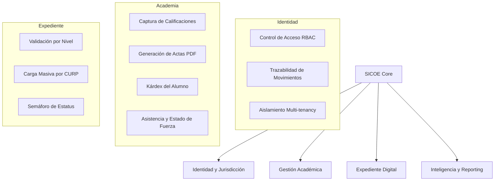
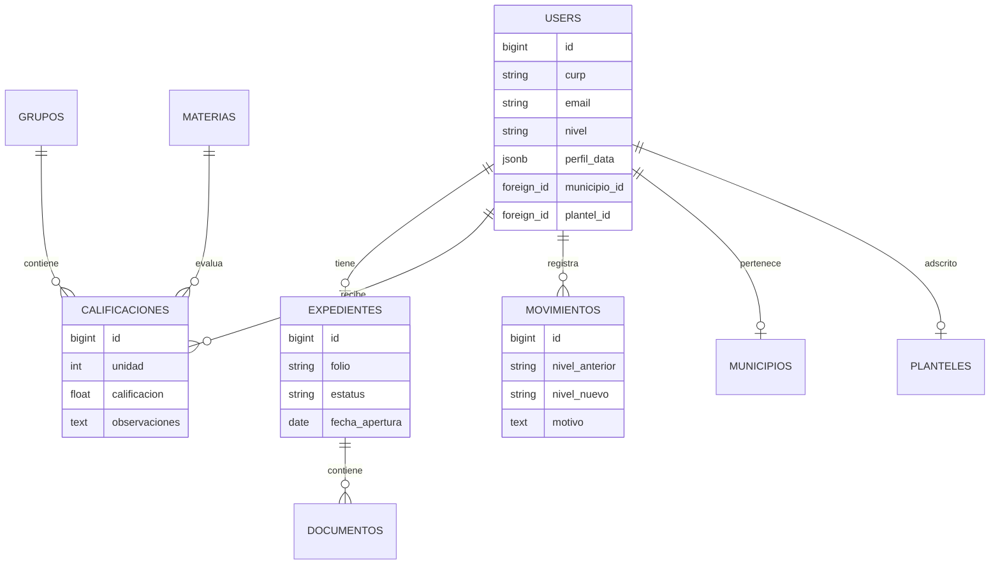

# 🚀 SICOE V2.0: Sistema Integral de Control Escolar y Expediente Único

Este documento proporciona una visión técnica y funcional del sistema para la presentación de las 11:00 AM.

## 1. Resumen Ejecutivo
SICOE es una plataforma de gobierno digital diseñada para la gestión integral de elementos de seguridad y personal administrativo. Su principal innovación es la capacidad **Multi-Nivel**, permitiendo que en una misma instancia convivan y sean gestionados elementos de **Seguridad Estatal, Municipal y Fiscalía**, garantizando la privacidad de los datos mediante un aislamiento lógico por jurisdicción.

---

## 2. Arquitectura de Módulos
El sistema se organiza en 4 grandes pilares funcionales:

### Detalle de Módulos Clave:
*   **Identidad Universal:** Permite el registro flexible de perfiles mediante campos dinámicos (JSONB), soportando datos específicos para cada tipo de corporación sin redundancia en la base de datos.
*   **Jurisdicción (Jurisdiction):** Motor de seguridad que filtra automáticamente la información. Un administrador municipal solo ve a sus elementos; un administrador estatal ve los suyos. El Super Admin tiene visión global.
*   **Control Académico y Operativo:** Gestión de grupos, materias y unidades evaluativas. Incluye el nuevo módulo de **Estado de Fuerza** para monitoreo de asistencias en tiempo real y **Calendario Flexible** (Sábados/Domingos).

---

## 3. Esquema de Base de Datos (Relacional)
La base de datos opera sobre **PostgreSQL 17**, optimizada para grandes volúmenes de datos y búsquedas complejas en campos JSON.

---

## 4. Diferenciadores Tecnológicos
1.  **Tecnología de Vanguardia:** Construido con Laravel 12, Livewire 3 (Volt) y Alpine.js para una experiencia de usuario fluida sin recargas de página (SPA feeling).
2.  **Seguridad por Diseño:** Implementación de Trait `HasJurisdiction` que inyecta automáticamente filtros en todas las consultas de la aplicación.
3.  **Eficiencia Operativa:** Herramientas de carga masiva de archivos que reducen el tiempo de integración de expedientes en un 90%.
4.  **Estado de Fuerza en Tiempo Real:** Dashboard ejecutivo que permite visualizar la operatividad por Nivel, Plantel y Grupo mediante pases de lista sincronizados.
5.  **Calendario Flexible:** Soportado para regímenes de formación intensivos que incluyen sábados y domingos de forma nativa.
6.  **Reporting Profesional:** Motor de generación de PDF integrado para documentos oficiales y gestión de asistencias.

---

## 5. Próximos Pasos (Roadmap)
*   **Fase 3:** Integración de Asistencias Biométricas y códigos QR.
*   **Fase 4:** Portal del Alumno para consulta de Kárdex desde dispositivos móviles.
*   **Fase 5:** Módulo de Notificaciones en tiempo real para observancia de expedientes.

---
**Presentado por:** Equipo de Desarrollo SICOE
**Fecha:** 13 de marzo de 2026
